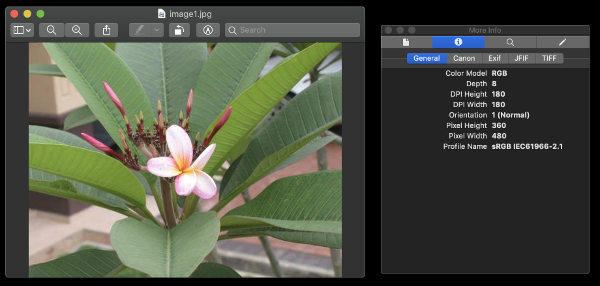
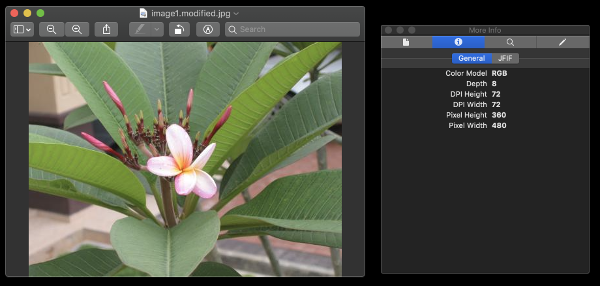

# exifremove

[](https://www.npmjs.com/package/exifremove)
[](https://circleci.com/gh/Coteh/exifremove)
[](https://codecov.io/gh/Coteh/exifremove)

Dependency-free Node.js module that simply removes all EXIF metadata from a single image or a set of images.

## What can this do?

Given an image like this, which contains EXIF and other APP1 metadata:



This module will strip out the metadata from the image, without any loss in quality:



(JFIF resides within the APP0 segment of the image, which is currently out of the scope of this module)

## Installation

```sh
npm install exifremove
```

or, if you would like to use the CLI:

```sh
npm install -g exifremove-cli
```

## Usage

### Module

Example of module usage:

```js
const fs = require('fs');
const exifremove = require('exifremove');

const image1 = fs.readFileSync('image1.jpg');
const image2 = fs.readFileSync('image2.jpg');

// Remove just one image's Exif
let image = exifremove.remove(image1);
console.log(image); // <Buffer ff d8 ...>

// Remove multiple images' Exif
let images = exifremove.removeMultiple([image1, image2]);
console.log(images);
/*
[
  <Buffer ff d8 ...>,
  <Buffer ff d8 ...>
]
*/
```

### CLI

```
exifremove [image0] ... [imageN]

Options:
  --version            Show version number                             [boolean]
  -v, --verbose        Print extra messages                              [count]
  --km, --keep-marker  Keeps the APP1 marker in the JPEG               [boolean]
  -h, --help           Show help                                       [boolean]
```

Check out the [CLI module's Readme](cli/README.md) for more information.
