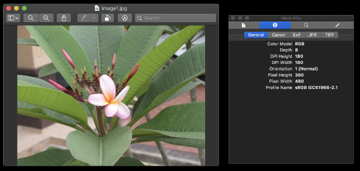
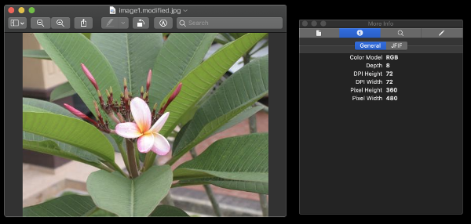

# exifremove

[](https://www.npmjs.com/package/exifremove)
[](https://github.com/Coteh/exifremove/actions/workflows/run-tests.yml)
[](https://codecov.io/gh/Coteh/exifremove)

Dependency-free Node.js module that simply removes all EXIF metadata from a single image or a set of images.

> [!NOTE]
> This package still works on Node.js 14 through 20, but will be removed from support in a future release.

## What can this do?

Given an image like this, which contains EXIF and other APP1 metadata:



This module will strip out the metadata from the image, with no loss in quality:



(JFIF resides within the APP0 segment of the image, which is currently out of the scope of this module)

## Installation

```sh
npm install exifremove
```

or, if you would like to use the CLI:

```sh
npm install -g exifremove-cli
```

## Usage

### Module

Example of module usage:

```js
const fs = require('fs');
const exifremove = require('exifremove');

const image1 = fs.readFileSync('image1.jpg');
const image2 = fs.readFileSync('image2.jpg');

// Remove just one image's Exif
let image = exifremove.remove(image1);
console.log(image); // <Buffer ff d8 ...>

// Remove multiple images' Exif
let images = exifremove.removeMultiple([image1, image2]);
console.log(images);
/*
[
  <Buffer ff d8 ...>,
  <Buffer ff d8 ...>
]
*/
```

### CLI

```
exifremove [image0] ... [imageN]

Options:
  --version            Show version number                             [boolean]
  -v, --verbose        Print extra messages                              [count]
  --km, --keep-marker  Keeps the APP1 marker in the JPEG               [boolean]
  -h, --help           Show help                                       [boolean]
```

Check out the [CLI module's Readme](cli/README.md) for more information.

## Runtime Support

exifremove works across multiple JavaScript runtimes. The CI pipeline runs the full test suite against each one.

| Runtime | Install | Invoke example |
|---|---|---|
| **Node.js** | `npm install exifremove` | `node examples/node/index.js photo.jpg` |
| **Deno** | no install needed | `deno run --allow-read --allow-write examples/deno/index.ts photo.jpg` |
| **Bun** | `bun add exifremove` | `bun run examples/bun/index.ts photo.jpg` |
| **Cloudflare Workers** | `npm install exifremove` | `wrangler dev examples/cloudflare-workers/index.js` |
| **Vercel Edge Runtime** | `npm install exifremove` | deploy via Vercel or use `vercel dev` |

### Node.js

```js
const { remove } = require('exifremove');
const fs = require('fs');

const output = remove(fs.readFileSync('photo.jpg'));
fs.writeFileSync('photo.modified.jpg', output);
```

### Deno

```ts
import { remove } from 'npm:exifremove';

const input = await Deno.readFile('photo.jpg');
const output = remove(Buffer.from(input));
await Deno.writeFile('photo.modified.jpg', output);
```

### Bun

```ts
import { remove } from 'exifremove';
import { readFileSync, writeFileSync } from 'fs';

const output = remove(readFileSync('photo.jpg'));
writeFileSync('photo.modified.jpg', output);
```

### Cloudflare Workers

```js
import { remove } from 'exifremove';

export default {
    async fetch(request) {
        const imageData = await request.arrayBuffer();
        const result = remove(Buffer.from(imageData));
        return new Response(result, { headers: { 'Content-Type': 'image/jpeg' } });
    },
};
```

Run locally with `wrangler dev examples/cloudflare-workers/index.js`, then `curl -X POST --data-binary @photo.jpg http://localhost:8787 > photo.modified.jpg`.

### Vercel Edge Runtime

```ts
import { remove } from 'exifremove';

export const config = { runtime: 'edge' };

export default async function handler(request: Request): Promise<Response> {
    const imageData = await request.arrayBuffer();
    const result = remove(Buffer.from(imageData));
    return new Response(result, { headers: { 'Content-Type': 'image/jpeg' } });
}
```
